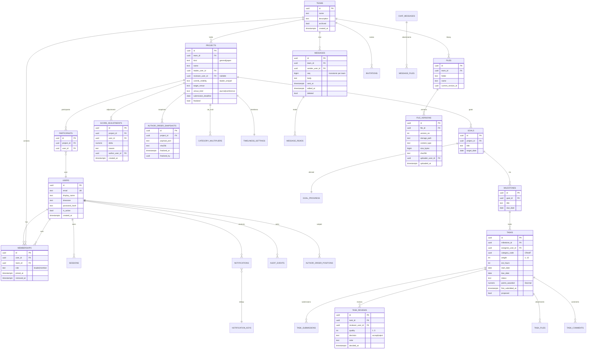

# Architecture

## System diagram

```
┌────────────────────────┐        HTTPS / WSS         ┌──────────────────────────┐
│  React + TS frontend   │  ───────────────────────▶  │  FastAPI backend (api)    │
│  Vite + TanStack Query │   /api/v1, /api/v1/ws/...  │  Pydantic v2 schemas      │
│  Tailwind, a11y        │   httpOnly cookies + CSRF  │  Service layer (pure)     │
└────────────┬───────────┘                            │  SQLAlchemy 2 ORM         │
             │                                        │  Alembic migrations       │
             │                                        │  APScheduler jobs         │
             │                                        │  StorageBackend iface     │
             │                                        │   ├── LocalDiskStorage    │
             │                                        │   └── (S3Storage future)  │
             │                                        │  WebSocket hub            │
             │                                        └──────┬─────────┬──────────┘
             │                                               │         │
             │                                               │         │
             │                                          ┌────▼───┐ ┌───▼────┐
             │                                          │Postgres│ │ Redis  │
             │                                          └────────┘ └────────┘
             │
       SMTP / console mailer (NOTIF-03)
```

## Module boundaries

Backend (Python, src layout under `backend/app/`)

- `core/` — settings, security primitives, error envelope, clock interface, idempotency keys
- `db/` — SQLAlchemy 2 declarative base, session factory, migration env
- `models/` — ORM models per domain
- `schemas/` — Pydantic v2 request/response models
- `services/` — pure business rules; no FastAPI imports
- `api/v1/` — route handlers (thin); depend on services + auth
- `api/deps.py` — auth dependencies (current_user, team_membership, role checks)
- `scoring/` — pure Decimal scoring module (NO db/network/clock)
- `storage/` — `StorageBackend` + `LocalDiskStorage`
- `realtime/` — WebSocket hub, presence, broadcast
- `notifications/` — domain notifier + idempotent scheduler jobs
- `tests/` — pytest, schemathesis, hypothesis, integration

Frontend (Vite + React + TS strict under `frontend/src/`)

- `app/` — router, providers (QueryClient, Auth, Toast)
- `features/<feature>/` — vertical slices: `accounts`, `teams`, `projects`, `tasks`, `schedule`, `notifications`, `chat`, `files`, `scoring`, `exports`
- `components/` — design system primitives (Button, Modal, Table, …)
- `lib/` — api client (with CSRF + cookie creds), time/timezone helpers, types

## Data model (Mermaid ER)



## Permission matrix

Roles per team: **leader**, **member**, **outsider** (authed user not in team), **removed** (was a member, removed), **anonymous**.

`R` = allowed, `X` = forbidden, `view` = read-only / 200, `403` = forbidden, `401` = unauth, `404` = hide existence.

For endpoints that take a project_id or message_id, the same role test applies *per resource* (e.g. an outsider sees 404, not 403).

| ID | Endpoint | leader | member | outsider | removed | anon |
|----|----------|:------:|:------:|:--------:|:-------:|:----:|
| AUTH-01 | POST /auth/signup | R | R | R | R | R |
| AUTH-02 | POST /auth/login | R | R | R | R | R |
| AUTH-02 | POST /auth/logout | R | R | R | R | 401 |
| AUTH-02 | POST /auth/refresh | R | R | R | R | R |
| AUTH-03 | POST /auth/password/reset | R | R | R | R | R |
| AUTH-03 | POST /auth/password/reset/confirm | R | R | R | R | R |
| AUTH-04 | GET/PATCH /me | R | R | R | R | 401 |
| TEAM-01 | POST /teams | R | R | R | R | 401 |
| TEAM-01..07 | GET /teams/{id} | view | view | 404 | 403 | 401 |
| TEAM-02 | POST /teams/{id}/invitations | R | X | 404 | 403 | 401 |
| TEAM-03 | POST /invitations/{token}/accept | R | R | R | R | R |
| TEAM-04 | DELETE /teams/{id}/members/{uid} | R | X | 404 | 404 | 401 |
| TEAM-05 | POST /teams/{id}/transfer-leader | R | X | 404 | 403 | 401 |
| TEAM-06 | POST /teams/{id}/archive | R | X | 404 | 403 | 401 |
| PROJ-01 | POST/GET /teams/{id}/projects | RW | RO(create=no) | 404 | 403 | 401 |
| PROJ-01 | PATCH/DELETE /projects/{pid} | RW | RO | 404 | 403 | 401 |
| PROJ-03..05 | POST/PATCH/DELETE goals, milestones, tasks | RW | RO(comment, propose, submit own) | 404 | 403 | 401 |
| PROJ-05 | PATCH task status (own) | RW | RW(own) | 404 | 403 | 401 |
| PROJ-07 | POST task submit | RW | RW(own) | 404 | 403 | 401 |
| PROJ-08 | POST task review | RW | RW(if reviewer) | 404 | 403 | 401 |
| SCHED-01 | POST schedules | R | X | 404 | 403 | 401 |
| SCHED-02/03 | GET calendar/timeline | view | view(own + team) | 404 | 403 | 401 |
| NOTIF-01 | GET notifications | R | R | R | R | 401 |
| NOTIF-04 | POST notification trigger | admin | X | 404 | 403 | 401 |
| CHAT-01 | WS /teams/{id}/chat | RW | RW | 404 | 403 | 401 |
| CHAT-02 | GET messages | view | view | 404 | 403 | 401 |
| CHAT-04 | DELETE message | RW | RW(own) | 404 | 403 | 401 |
| FILE-01 | POST upload | R | R | 404 | 403 | 401 |
| FILE-01..07 | GET/DELETE files | view | view | 404 | 403 | 401 |
| SCORE-01..13 | GET/POST scoring data | RW | RW(visibility setting) | 404 | 403 | 401 |
| SCORE-09/10 | POST finalize order | R | X | 404 | 403 | 401 |
| SEC-02 | GET audit log | view | X | 404 | 403 | 401 |

Every cell is filled. Permission tests are generated by walking this table.

## Sequence — chat delivery

```
Client A                    Backend WS hub                Postgres
   |  WS upgrade + token         |                            |
   |---------------------------->|                            |
   |  authenticate, accept       |                            |
   |<-----------------------------|                            |
   |  send {body}                |                            |
   |---------------------------->|                            |
   |                             | INSERT message (seq=N+1)   |
   |                             |--------------------------->|
   |                             |<-- commit                  |
   |<-- {id, seq=N+1, ...}       |                            |
   |  fan-out to team sockets    |                            |
   |  WS push to Client B        |                            |
   |<-- {id, seq=N+1, ...}       |                            |
   |                             | UPDATE last_read for B     |
   |                             |--------------------------->|
```

Reconnect: client sends `last_seq`. Server returns gap `{from: last_seq+1, messages: [...]}`. Out-of-order → drop duplicates by `seq`.

## Sequence — file upload

```
Client             Backend                          Storage            Postgres
  | POST /files/...  |                                |                     |
  | multipart ------->| sniff content, sha256         |                     |
  |                   | path = teams/t/{yyyy}/{mm}/... |                     |
  |                   | write bytes ----------------->|                     |
  |                   | check size + sha              |                     |
  |                   | INSERT file (or new version)                       |
  |                   |---------------------------------------------------->|
  |<-- 201 {file_id, version}                                            |
  | GET /files/{id}/download                                            |
  |---------------->| HEAD StorageBackend, fetch bytes                  |
  |                   |------------------------------------------------->|
  |<-- stream + Content-Disposition: attachment; X-Content-Type-Options: nosniff
```

Path-traversal, double-extension, archive-entry traversal checks happen server-side before bytes hit disk.

## Scoring design

See `docs/scoring-methodology.md` for the formula, settings, and a worked example. Architectural points:

- `backend/app/scoring/engine.py` is pure: takes `ScoreInputs` (dataclass), returns `ScoreResult` (dataclass), no I/O, no `datetime.now()`, no `Decimal.getcontext()` writes inside. Tests pass an injected context.
- One row of score per accepted task (`points_awarded Decimal(20,6)`). Manual adjustments are separate rows in `score_adjustments`; the final total is `sum(task.points_awarded) + sum(adjustments)`.
- Tie-breaker: alphabetical by display name (case-insensitive, locale-aware), then by user_id ULID for absolute stability.
- Snapshot payload (JSON, then SHA-256):
  ```json
  {
    "project_id": "...",
    "finalized_at": "...",
    "finalized_by": "...",
    "formula_version": "1.0.0",
    "settings": { "timeliness_bands_days": [2,7], "...": "..." },
    "participants": [{"user_id":"...","display_name":"...","points":"...","adjustments":[...],"tasks":[...]}],
    "order": [{"position":1,"user_id":"...","note":null}, ...],
    "tie_breaker": "display_name_ci_asc,user_id"
  }
  ```

Decimals: `Decimal('0.000000')` for points_awarded. Multiplications performed in `Decimal` context with 28-digit precision; final rounding to 6 places with `ROUND_HALF_UP`.


## v2 (Phase 6+) additions

### Design system

The frontend visual language is built on a small set of CSS custom
properties (in `frontend/src/index.css`):

- A near-black / near-white pair for text and background.
- Three grays for borders, secondary text, and tertiary text.
- Exactly one accent (indigo) used for primary actions and active states.
- Semantic status colors (info, warn, danger, ok) are used only when
  paired with an icon or text label — never color alone.

Dark mode is a class on `<html>` rather than CSS inversion: the tokens
themselves flip values. The choice is persisted in `localStorage`
under `tl.theme` and the per-user `theme` column on the User row is the
source of truth on the server (set via `PATCH /me`).

### Profile pictures and avatars

Uploads hit `POST /me/avatar` as `multipart/form-data`. The server
validates by magic bytes (PNG, JPEG, WebP, GIF), then re-encodes two
sizes: 64 px for lists and 256 px for the profile page. The original
upload is never served. A user without a photo gets a deterministic
initials badge on a color derived from their user ID hash — the same
person always gets the same color, never a broken-image icon.

`GET /users/{id}/avatar?size=small|large` serves the bytes. Cache
headers: `public, max-age=300`.

Removed members' avatars stay attached to historical messages, tasks,
and contribution records — the same way their name does.

### Email verification + signup rate limit

`POST /auth/signup` is rate-limited per-IP and per-email (default 5/min).
It issues a one-time email-verification token, mails it via the
configured mailer (console / SMTP / Resend), and auto-logs the user in.
`POST /auth/verify-email` consumes the token and marks the user verified.
`POST /auth/resend-verification` requires auth and re-issues.

The signup endpoint also pre-fills an `institution` field when the
email's domain matches a recognizable academic pattern
(`ac.uk`, `edu`, `ac.jp`, `…`).

### Activity feed derived from audit log

There is no parallel "notifications" stream — the existing append-only
`audit_events` table is the only source. `GET /activity` and
`GET /teams/{id}/activity` project those rows into typed feed items
(mention, thread_reply, reaction, task_assigned, task_reviewed,
milestone, member, system), with `href` deep-links into the app.

`GET /activity/unread-count` and `POST /activity/read` operate on the
Notification table, which is keyed on (user_id, type, …). The frontend
polls the unread-count endpoint every 30 s.

### Global search

`GET /search?q=…` searches across messages, task titles, and file
names, scoped to the caller's current memberships. Results are grouped
by type on the client (the palette renders a "T / M / F" prefix on each
hit). The endpoint is auth-only; never exposed publicly.

### Production deploy shape

`backend/Dockerfile` is a multi-stage build:

1. Node stage builds the SPA with `npm run build`.
2. Python stage installs the backend, copies the built SPA into
   `/app/static`, and starts uvicorn on port 8000.

The FastAPI app mounts `/assets/` from `static/` and serves
`index.html` for everything not under `/api/` so React Router owns the
URL space on the frontend. There is no separate static host.

`render.yaml` documents the env vars for the API service. The
live setup is the split deploy (SPA on Vercel, API on Render) —
see `DEPLOY_SPLIT_VERCEL_RENDER.md`. `backend/.env.example` is the contract that needs to match in production.

### Sleep / wake expectations

- A Render service on the *free* compute plan sleeps after 15 minutes
  without inbound traffic. The next request can take about a minute to wake
  (Render serves a loading page meanwhile) — normal, not a bug. Paid plans remove it.
- Neon free Postgres scales to zero when idle. The first query after a
  quiet period takes ~1-2 s longer while the compute warms. The
  connection string stays valid; do not recreate the database.
- Avatars and file storage are local to the Render service today and
  do NOT survive a redeploy that wipes the disk. For a real production
  install, swap `STORAGE_BACKEND=local` for an S3-compatible backend
  (the storage layer is already abstracted behind an interface).

